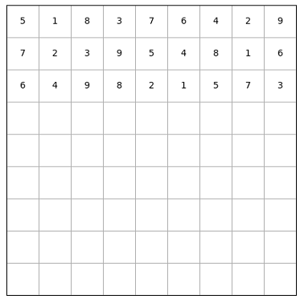
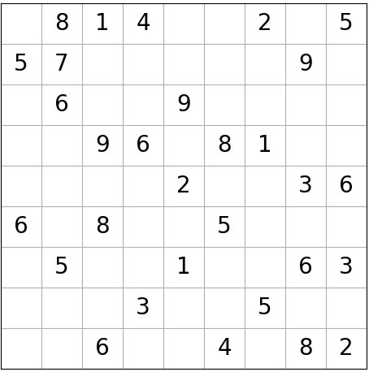
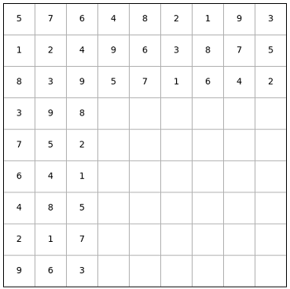
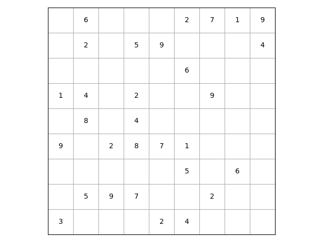
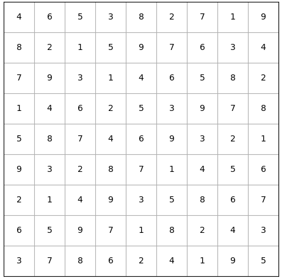

# Sudoku_solver
 just solving a sudoku board using python

 I used recursion to solve sudoku, later found out that its called back-tracking

There are some algorithms that makes a filled sudoku in a fast and reliable way, 
notably the method listed below:
- 1.) Generate a permuted list of 1-9 and placing them on the first row
- 2.) shift the first row by three and place it on the second row
- 3.) shift the second row by three and place it on the third row 
- 4.) shift by 1 for the 4th row, then shift by 3 for 5th and 6th row
- 5.) do step 4 with 7th, 8th, and 9th row
- 6.) using some rules, permute the block row and or column
This is a O(N**2) generator where N is the length of one side.

I didn't use this method because the number of possible sudoku board is limited (although this is a huge number), and I wanted to make a pure random sudoku generator that have unique solutions.

My method of generating a sudoku board is to first fill the top 3 blocks with valid random values, then transpose the matrix and fill the "new" top row with valid random values.

step 1.) fill the top 3 blocks 

transpose the matrix 

then fill the top three board and transpose it back 

then use the recursive sudoku solver to make a filled randomized sudoku board, then start making batches of random positions and check the uniqueness of the solution if they're removed.  if the uniqueness is preserved, remove the values in those positions, if there's a divergence in the number of solutions, then use a new random batch and start over.  Exit the removing stage if enough entries are removed.

Outputs:
Random empty sudoku board:

solved sudoku board:

