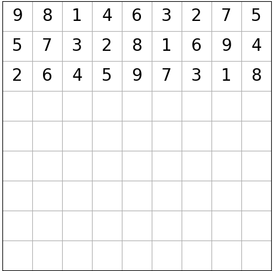
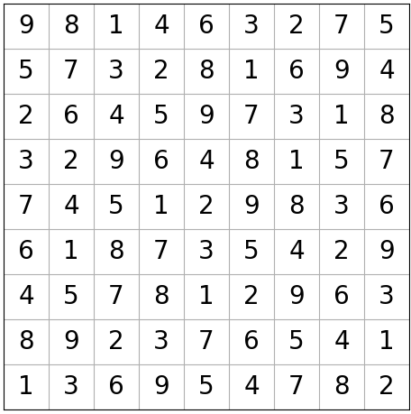

# Sudoku_solver
This repo has a sudoku board generator and two backtracking solver with different problem solving methods, all implemented in Python 

---
### Updates & future plans:
- Exact cover method is finished in Python
- If I feel like it, I'll code the Exact cover method using dancing links in C++
---
## Table of Contents:
- [Dependencies](#depen)
- [Sudoku Solver](#solver)
    - [My Backtracking solver](#solver1)
    - [Exact Cover Method](#solver2)
- [Sudoku Generator](#generator)
    - [Visual of the Generator](#visual)
- [Output of the Code](#output)

---

## Dependencies
- Matplotlib, visualize the unsolved and solved board states and allows them to be stored as .png
- Numpy, used together with matplotlib
- itertools, easy way to make cartesian product

---
  

## Sudoku Solver 

### My Backtracking Solver
I used recursion (later found out that it's called backtracking) to solve a sudoku board.  The function that finds the solutions is implemented as a generator.

  

### Exact Cover Method
The exact cover method implemented is from Donald E. Knuth's TAoCP Vol 5 Fascicle 5.
I have four dictionaries called p_dict, r_dict, c_dict, and b_dict, and the keys that are associated with a given cover is stored as a tuple in a separate dictionary called cover_dict. Also, the keys are tuples because they have to be hashable.
<table>
    <thead>
        <tr>
            <th align="center">Dict name</th>
            <th align="center">Keys</th>
            <th align="center">Stored Value</th>
        </tr>
    </thead>
    <tbody>
        <tr>
            <td align="center">p_dict</td>
            <td align="center">(i, j)</td>
            <td align="center">set of k</td>
        </tr>
        <tr>
            <td align="center">r_dict</td>
            <td align="center">(i, k)</td>
            <td align="center">set of j</td>
        </tr>
        <tr>
            <td align="center">c_dict</td>
            <td align="center">(j, k)</td>
            <td align="center">set of i</td>
        </tr>
        <tr>
            <td align="center">b_dict</td>
            <td align="center">(x, k)</td>
            <td align="center">set of (i, j)</td>
        </tr>
         <tr>
            <td align="center">cover_dict</td>
            <td align="center">(i, j, k)</td>
            <td align="center">keys for p_dict, r_dict, c_dict, b_dict</td>
        </tr>
    </tbody>
</table>

- p(i, j) stores a set of all numbers that can be stored in the cell (i, j)
- r(i, k) stores a set of indices, j, where the number k can be stored in column i 
- c(j, k) stores a set of indices, i, where the number k can be stored in row j
- b(x, k) stores a set of positions which the number k can be stored in within that box

Then the backtracking algorithm chooses the coordinate (i, j) with the smallest branching factor and fills that cell.  If a cell is filled, then it removes the associated elements.  The backtracker will remove values from the stored set or remove it entirely depending on the situation, and when a solution is found, the dictionaries will all be empty. If a filled cell needs to be emptied, then the removed values are put back in the dictionaries. Then repeat the process until all solutions are found.

My thought process and deeper explanation of the code are commented in the exact_cover_solver.py

---
  
## My Sudoku Generator
---
I didn't use this method, but some algorithms make filled sudoku in a fast and reliable way, notably the method listed below:
- 1.) Generate a permuted list of 1-9 and placing them on the first row
- 2.) shift the first row by three and put it on the second row
- 3.) shift the second row by three and place it on the third row 
- 4.) shift by 1 for the 4th row, then shift by 3 for 5th and 6th row
- 5.) do step 4 with 7th, 8th, and 9th row
- 6.) using some rules, permute the block row and or column
---

I didn't use this method because the number of possible empty sudoku boards is limited, although the number of possible output states is enormous. I wanted to make a pure random sudoku generator that can output all possible states with unique solutions with non-zero probability, so I made my method of generating a sudoku board.
My method of generating a sudoku board is to fill the top 3 blocks with valid random values, then transpose the matrix and fill the "new" top row with valid random values. Then you have blocks filled in an L shape, and filling in the blocks is easy because of the constraints are independent of each other, then use the recursive solver to fill in the rest.  The recursive solver chooses randomly from the possible numbers that can be entered in that cell, so the randomness of the output is not damaged.

---
 
## Visual Interpertation of the Generating Algorithm:
| 1.) fill the top 3 blocks |2.) Transpose the matrix | 3.) & 4.) Fill the new top blocks and transpose it back|
|---------------------------|---------------------------|---------------------------|
|    |    |    |

Then fill the rest with valid random values.  After the recursive solver makes a filled randomized sudoku board, start making batches of random positions and check the uniqueness of the solution if they're removed.  If the uniqueness is preserved, delete those values in those positions, if there's a divergence in the number of solutions, then use a new random batch and start over.  Exit the removing stage if the required number of entries are removed.  By checking the number of solutions, we can observe which cell values are vital to preserving the uniqueness of the solution.

---
 
## Outputs:
|Random empty board state:|Solved board state: |
|--------------------------|-----------------------|
| | |
